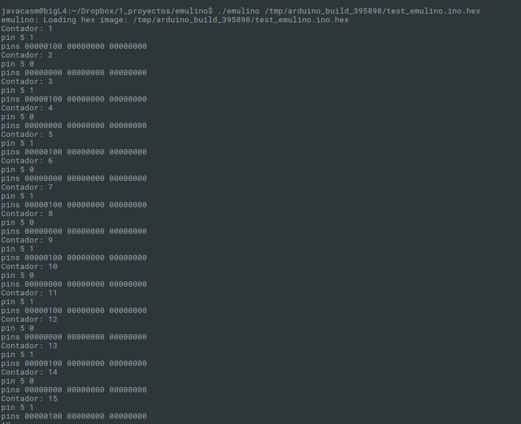

# Emulino

Emulador de Arduino que ejecuta los ficheros .hex
Creado por Greg Hewgill ( @ghewgill http://hewgill.com/ )

( se puede descargar el exe desde http://sourceforge.net/projects/sdaaubckp/files/emulino/10.04/emulino/download )

## Ejemplo

      #define PIN_LED 13
      #define ESPERA 1000
      int counter = 0;

      void setup()
      {
          Serial.begin(115200);
          pinMode(13,OUTPUT);      
      }

      void loop()
      {
        counter = counter + 1;
        Serial.print("Contador: ");
        Serial.println(counter);
        digitalWrite(PIN_LED,!digitalRead(PIN_LED));

        delay(ESPERA);
      }

Verificamos y ejecutamos emulino con el hex generado (suele estar en /tmp/arduino_build_xxxxx/fichero.hex)

[Versiones más evolucionadas](https://github.com/BlackMac/altoyduino-emu)

## Referencias

[doc](https://wiki.ubuntu.com/Emulino)
[Sobre su desarrollo, funcionamiento interno y problemas de compilación](http://ghewgill.livejournal.com/129929.html)
[sobre errores de compilación](http://hewgill.com/journal/entries/507-emulino-arduino-cpu-emulator.html)
[Listado de emuladores/simuladores de Arduino](https://www.smashingrobotics.com/arduino-simulators-lineup-start-developing-without-real-board/)
